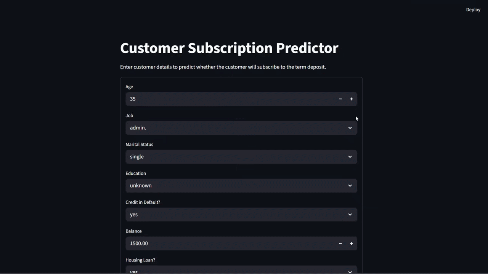

# Customer Subscription Prediction System

A machine learning system that predicts whether a bank customer will subscribe to a **term deposit** based on demographic and campaign-related information.

The project includes:

- Machine Learning model training pipeline
- FastAPI prediction service
- Streamlit user interface
- End-to-end deployment-ready architecture

---

# Project Architecture
```
User Browser
     │
     ▼
Streamlit UI (ui/app.py)
     │
     ▼
FastAPI API (api/main.py)
     │
     ▼
Prediction Engine (src/predict.py)
     │
     ▼
Preprocessing Pipeline (src/preprocess.py)
     │
     ▼
Trained RandomForest Model (models/)
```

- **Streamlit UI** collects customer information
- **FastAPI API** handles prediction requests
- **ML Model (Random Forest)** generates subscription predictions

---

# Project Structure

```
customer-prediction-ml-system
│
├── api/                # FastAPI application
│   └── main.py
│
├── data/               # Dataset used for training
│
├── models/             # Trained model artifacts
│   ├── trained_model.joblib
│   ├── feature_columns.joblib
│   └── model_metadata.json
│
├── notebooks/          # Exploratory analysis and experimentation
│   └── customer_predict_model.ipynb
│
├── src/                # Core ML pipeline
│   ├── preprocess.py
│   ├── train.py
│   ├── predict.py
│   └── schemas.py
│
├── ui/                 # Streamlit user interface
│   └── app.py
│
├── tests/              # Testing scripts
│
├── requirements.txt
├── LICENSE
└── README.md
```

---

# Machine Learning Model

Model used:
- **Random Forest Classifier**

Key steps in the pipeline:
- Data preprocessing
- Feature engineering
- One-hot encoding for categorical variables
- Train/test split with stratification
- Hyperparameter tuning
- Threshold optimization for imbalanced classification

Evaluation results:
```
Precision (class 1): ~0.51
Recall (class 1): ~0.54
F1-score: ~0.52
Accuracy: ~0.89
```

The decision threshold was tuned to **0.4** to better balance precision and recall for the minority class.

---

# User Interface

Example Streamlit interface:



Users can input customer information and receive an instant prediction of whether the custom

---

# Installation
Clone the repository:
```bash
git clone https://github.com/<your-username>/customer-prediction-ml-system.git
cd customer-prediction-ml-system
```

Create virtual environment:
```bash
python -m venv venv
```

Activate environment:
```bash
Windows:
venv\Scripts\activate
```

Install dependencies:
```bash
pip install -r requirements.txt
```

--- 

# Training the Model
Run the training script:
```bash
python -m src.train
```

This will generate:
```
models/
trained_model.joblib
feature_columns.joblib
model_metadata.json
Running the FastAPI Server
```

Start the API:
```bash
uvicorn api.main:app --reload
```

API documentation available at: 
```
http://127.0.0.1:8000/docs
```

---

# Running the Streamlit UI
Start the user interface:
```bash
streamlit run ui/app.py
```

Then open:
```
http://localhost:8501
```

---

# Example Prediction API Request
Endpoint:
```
POST /predict
```

Example request body:
```bash
{
  "age": 35,
  "job": "management",
  "marital": "married",
  "education": "tertiary",
  "Credit": "no",
  "balance": 1500,
  "housing_loan": "yes",
  "personal_loan": "no",
  "contact": "cellular",
  "last_contact_day": 12,
  "last_contact_month": "may",
  "last_contact_duration_sec": "180 sec",
  "campaign": 2,
  "pdays": -1,
  "previous": 0,
  "previous_marketing_campaign": "unknown"
}
```

Example response:
```bash
{
  "prediction": 0,
  "label": "Not Subscribed",
  "probability": 0.1383,
  "threshold_used": 0.4
}
```

---

# Technologies Used
- Python
- Pandas
- Scikit-learn
- FastAPI
- Streamlit
- Joblib
- Pydantic
- License
- This project is licensed under the MIT License.

---

# License
This project is licensed under the **MIT License**.